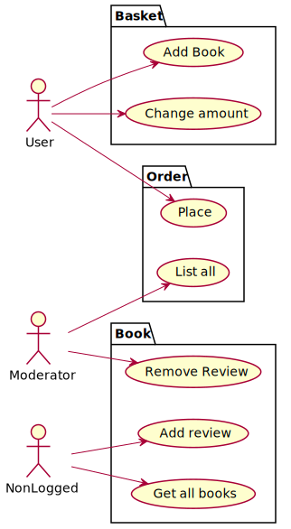
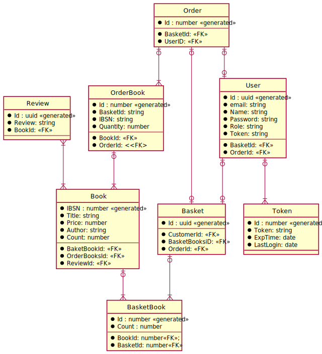

# Project-sql _Neoteric Academy_

E-commerce backend for book shop written in _NestJs_ and _TypeORM_. _PostgreSQL_ database was used in this project, also unit tests and e2e are provided.

## Features:

- REST API which provides managing data for users, books and reviews and placing orders
- Registration and login functionally
- Token authentications
- Roles for users
- Integrated with Swagger API platform

## Use cases

Backend implements below use cases for different user roles (roles with higher rights are able to do same thing as roles with lower rights).



### Endpoints

List of endpoints - for more details refer to endpoints API section

| function                            | endpoint              | method | data by |
| ----------------------------------- | --------------------- | ------ | ------- |
| get all products                    | `/books`              | GET    | query   |
| insert product to database          | `/books`              | POST   | json    |
| delete product from database        | `/books/:IBSN`        | DELETE | json    |
| change price of book                | `/books/price/:IBSN`  | PATCH  | json    |
| place review for book               | `/books/review`       | POST   | json    |
| delete review for book              | `/books/review/:IBSN` | DELETE | json    |
| insert product in basket            | `/basket/add`         | POST   | json    |
| get all created baskets             | `/basket`             | GET    | query   |
| delete product from basket          | `/basket/:IBSN`       | DELETE | json    |
| update count of book in user basket | `/basket/:IBSN`       | PATCH  | json    |
| show all books in user basket       | `/basket/books`       | GET    | query   |
| create order for logged user        | `/order`              | POST   | query   |
| show list of created orders         | `/order`              | GET    | query   |
| register user                       | `/auth/register`      | POST   | query   |
| log in user                         | `/auth/login`         | POST   | query   |

### Roles

Every user has its own role which gives different accesses to endpoints.

- user
- moderator
- default role equals non logged user (no role)

Access matrix
| endpoint| method | user | moderator | non logged |
| --|------|------|-----|------------|
| `/books` | GET | :heavy_check_mark: | :heavy_check_mark: | :heavy_check_mark:|
| `/books` | POST | :x: | :heavy_check_mark:|:x: |
| `/books/:IBSN` | DELETE | :x: | :heavy_check_mark:|:x: |
| `/books/price/:IBSN` | PATCH | :x: | :heavy_check_mark:|:x: |
| `/books/review` | POST | :heavy_check_mark:|:heavy_check_mark:|:heavy_check_mark:|
| `/books/review/:IBSN` | DELETE | :x: | :heavy_check_mark:|:x: |
| `/basket/add` | POST | :heavy_check_mark:| :x: | :x: |
| `/basket` | GET | :x: | :heavy_check_mark: | :x: |
| `/basket/:IBSN` | DELETE | :heavy_check_mark: | :x: | :x: |
| `/basket/:IBSN` | PATCH | :heavy_check_mark: | :x: | :x: |
| `/basket/books` | GET |:heavy_check_mark: | :x: | :x: |
| `/order` | POST | :heavy_check_mark: | :x: | :x: |
| `/order` | GET | :x: | :heavy_check_mark: | :x: |
| `/auth/register` | POST | :x: | :x: | :heavy_check_mark: |
| `/auth/login` | POST | :x: | :x: | :heavy_check_mark: |

## Installation

Backend supports two way of installation using `docker` or by `npm`. Using docker compose database will be setup automatically. For non docker version data base instance should be prepared.

### Requirements:

- Docker: docker-compose (for docker version)
- Nodejs > 9
- npm
- PostgreSQL database

### Setup env file

For educational purposes env file will be provide below.

```sh
# DATABASE
DATABASE_USERNAME=postgres
DATABASE_PASSWORD=Haslo!234
DATABASE_NAME=Project2
DATABE_HOST=localhost
DATABASE_PORT= 5432

# JWT_SECRET
JWT_SECRET=secret

# DATE
DATE_CONTROLLER=6000000
DATE_SERVICE=600000
```

### Running using docker

Edit DB configuration in `docker-compose.yml`

```yaml
POSTGRES_PASSWORD: Haslo!234
POSTGRES_USER: postgres
POSTGRES_DB: Project
```

Execute docker-compose:

```sh
docker compose up
```

### Running using npm

First install dependencies:

```sh
npm install
```

Create instance of PostgreSQL database and use env mentioned earlier.
Run backend:

```sh
npm run start
```

During first run database migration will be performed.After that register new user log in and copy token from "Cookies" in postman and paste it ind Authorization with type Bearer Token. After 10 minutes token will be expired.

## Run Tests

In this test i will provide unit test for BasketService and e2e tests for BasketModule.
For database connection and guard mocks are provided so they are not required for testing.
To run test use following command.

`npm run test`

Result should be like this:

```sh
PASS  src/test/basket/basket.service.spec.ts
PASS  src/test/basket/basket.e2e.spec.ts (7.116 s)

Test Suites: 2 passed, 2 total
Tests:       19 passed, 19 total
Snapshots:   0 total
Time:        7.93 s, estimated 8 s
Ran all test suites.
```

## ERD

Backend uses TypeORM for implement following database relational model.


